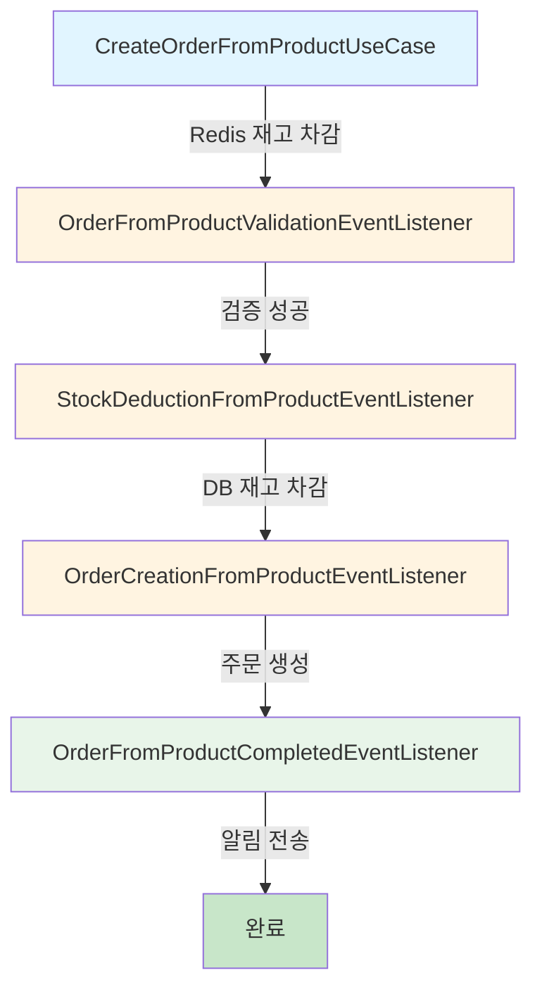
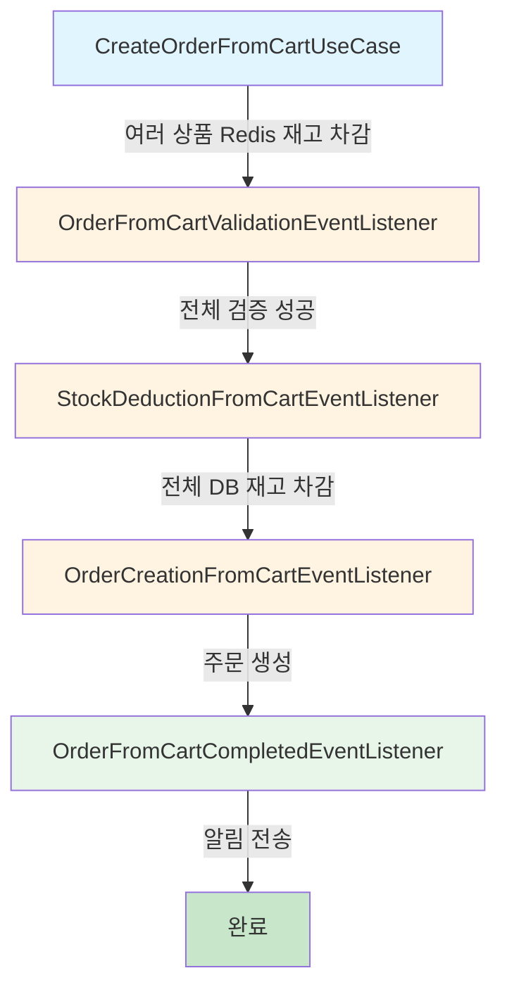
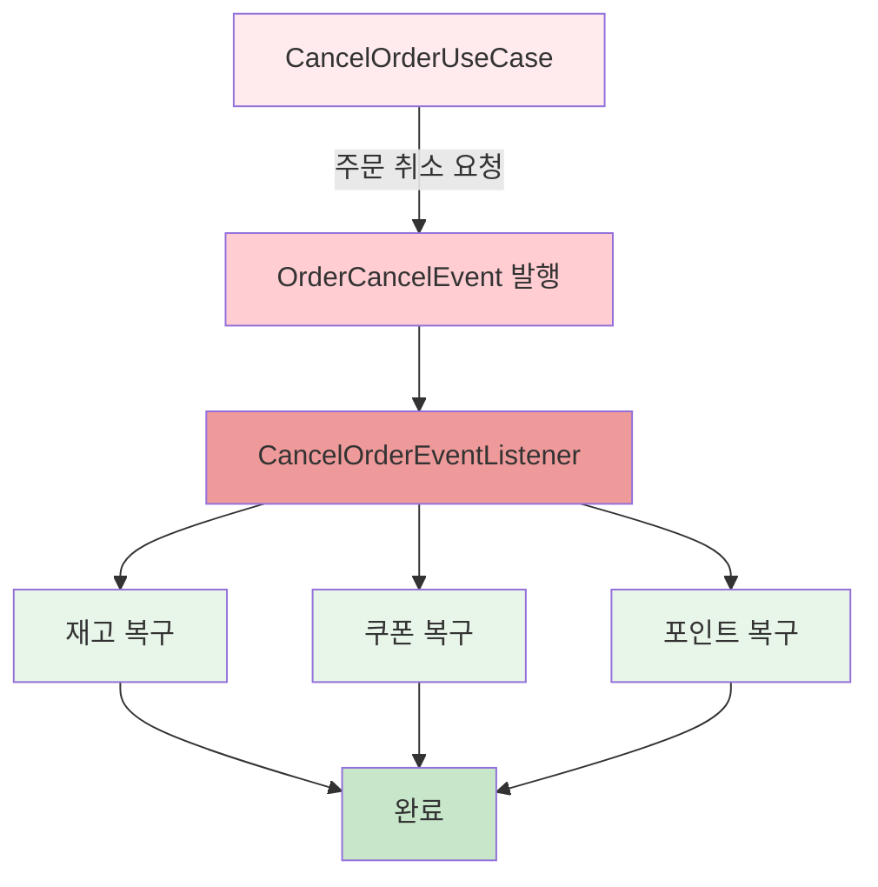
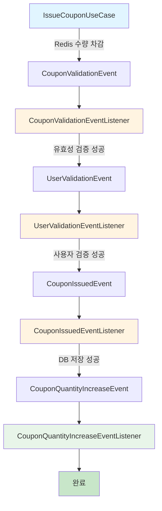
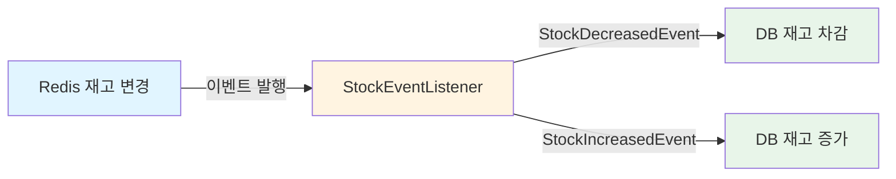
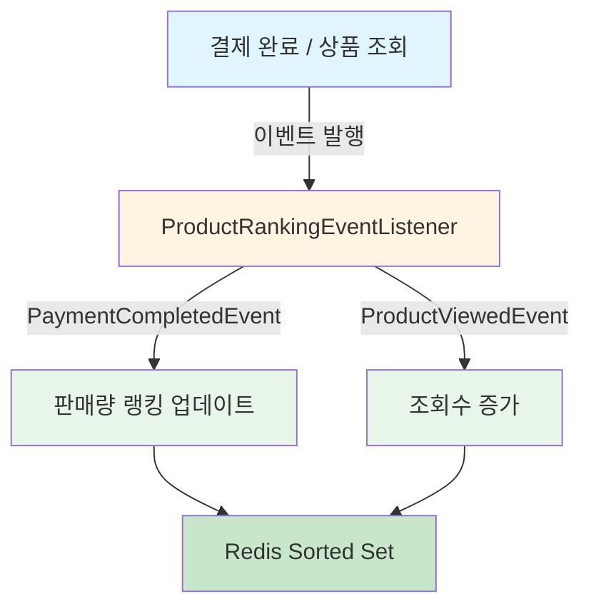
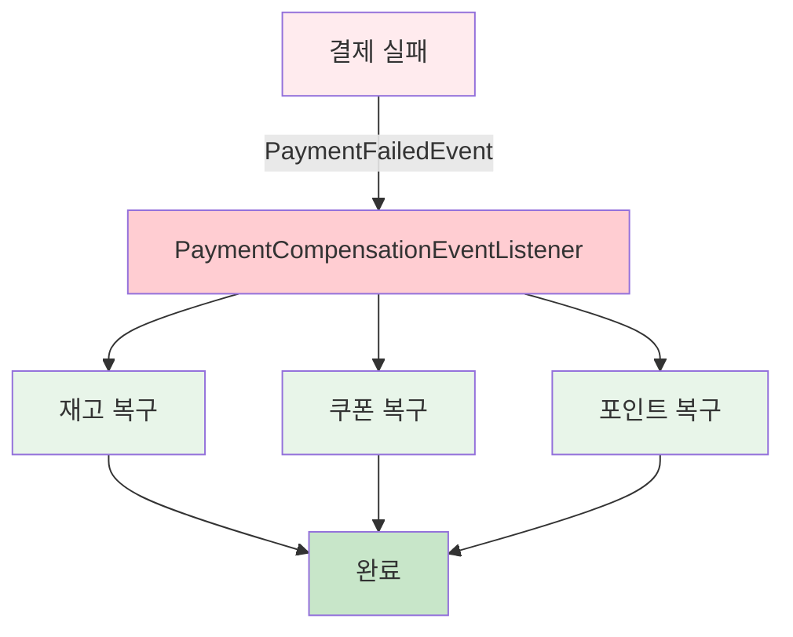

# 분산 시스템 환경의 트랜잭션 처리 전략 및 비동기 이벤트 아키텍처 보고서

## 📋 목차
1. [도메인 분리 환경의 트랜잭션 한계](#1-도메인-분리-환경의-트랜잭션-한계)
2. [SAGA 패턴을 통한 대응 방안](#2-saga-패턴을-통한-대응-방안)
3. [프로젝트 비동기 이벤트 현황](#3-프로젝트-비동기-이벤트-현황)
4. [기술 스택 및 아키텍처 패턴](#4-기술-스택-및-아키텍처-패턴)
5. [향후 확장 계획](#5-향후-확장-계획)

---

## 1. 도메인 분리 환경의 트랜잭션 한계

### 1.1 단일 DB 환경 (Monolithic Architecture)

전통적인 단일 DB 환경에서는 모든 작업이 하나의 데이터베이스에서 처리되므로, **Transaction 명령만으로 ACID 원칙을 쉽게 보장**할 수 있습니다.

```
┌─────────────────────────────────┐
│   Application Server            │
│                                  │
│   ┌──────────┐                  │
│   │Transaction│                 │
│   │  BEGIN    │                 │
│   │  ↓        │                 │
│   │ UPDATE A  │                 │
│   │ UPDATE B  │                 │
│   │ UPDATE C  │                 │
│   │  ↓        │                 │
│   │ COMMIT    │                 │
│   └──────────┘                  │
└─────────────────────────────────┘
            ↓
    ┌──────────────┐
    │   Single DB  │
    │   (ACID 보장) │
    └──────────────┘
```

**ACID 원칙**
- **A**tomicity (원자성): 전체 성공 또는 전체 실패
- **C**onsistency (일관성): 데이터 무결성 유지
- **I**solation (격리성): 트랜잭션 간 독립적 실행
- **D**urability (지속성): 커밋 후 영구 저장

### 1.2 도메인별 DB 분리 환경의 문제점

서비스 확장에 따라 **도메인별로 Application Server와 DB를 분리**하면 다음과 같은 문제가 발생합니다.

```
┌────────────────┐      ┌────────────────┐      ┌────────────────┐
│  Order Service │      │ Product Service│      │ Payment Service│
└────────┬───────┘      └────────┬───────┘      └────────┬───────┘
         ↓                       ↓                        ↓
    ┌─────────┐            ┌─────────┐            ┌─────────┐
    │Order DB │            │Product DB│           │Payment DB│
    └─────────┘            └─────────┘            └─────────┘
         ✅                      ❌                      ⏸️
```

#### **핵심 문제: 원자성(Atomicity) 상실**

- **Order DB**에서는 주문 생성 성공 ✅
- **Product DB**에서는 네트워크 오류로 재고 차감 실패 ❌
- **Payment DB**는 아직 실행되지 않음 ⏸️

➡️ **Order DB의 변경사항을 자동으로 ROLLBACK할 방법이 없음**
➡️ **데이터 정합성(Consistency) 깨짐**

#### **구체적 시나리오 예시**

```
시나리오: 사용자가 상품을 주문하는 경우

Step 1: Order Service - 주문 생성 ✅
  → Order DB에 주문 데이터 저장 성공

Step 2: Product Service - 재고 차감 ❌
  → Network Timeout 발생
  → Product DB 업데이트 실패

결과:
  ✅ 주문은 생성되었지만
  ❌ 재고는 차감되지 않음
  ⚠️ 실제 재고 없이 주문만 존재하는 상태 (데이터 불일치)
```

---

## 2. SAGA 패턴을 통한 대응 방안

### 2.1 SAGA 패턴이란?

**SAGA 패턴**은 분산 트랜잭션을 여러 개의 로컬 트랜잭션으로 나누고, 각 서비스가 **비동기 이벤트**를 발행하여 다음 단계를 진행하며, **실패 시 보상 트랜잭션(Compensating Transaction)**으로 앞선 단계를 점진적으로 롤백하는 패턴입니다.

### 2.2 SAGA 패턴 동작 방식

```
정상 흐름 (Forward Transaction):
  Order Service     → Product Service    → Payment Service
  주문 생성 ✅      → 재고 차감 ✅       → 결제 처리 ✅

실패 시 보상 흐름 (Compensating Transaction):
  Order Service     ← Product Service    ← Payment Service
  주문 취소 🔄      ← 재고 복구 🔄       ← 결제 실패 ❌
```

### 2.3 구현 예시: 주문 생성 SAGA

#### **정상 흐름**

```
┌─────────────────────────────────────────────────────────┐
│ Step 1: Order Service                                    │
│   → 주문 생성 (Order DB)                                 │
│   → OrderCreatedEvent 발행                               │
├─────────────────────────────────────────────────────────┤
│ Step 2: Product Service (이벤트 수신)                    │
│   → 재고 차감 (Product DB)                               │
│   → StockDeductedEvent 발행                              │
├─────────────────────────────────────────────────────────┤
│ Step 3: Payment Service (이벤트 수신)                    │
│   → 결제 처리 (Payment DB)                               │
│   → PaymentCompletedEvent 발행                           │
├─────────────────────────────────────────────────────────┤
│ ✅ 전체 성공                                             │
└─────────────────────────────────────────────────────────┘
```

#### **실패 및 보상 흐름**

```
┌─────────────────────────────────────────────────────────┐
│ Step 1: Order Service                                    │
│   → 주문 생성 ✅                                         │
│   → OrderCreatedEvent 발행                               │
├─────────────────────────────────────────────────────────┤
│ Step 2: Product Service                                  │
│   → 재고 차감 ✅                                         │
│   → StockDeductedEvent 발행                              │
├─────────────────────────────────────────────────────────┤
│ Step 3: Payment Service                                  │
│   → 결제 처리 ❌ (카드 승인 실패)                        │
│   → PaymentFailedEvent 발행                              │
├─────────────────────────────────────────────────────────┤
│ Compensation Step 2: Product Service                     │
│   → PaymentFailedEvent 수신                              │
│   → 재고 복구 🔄                                         │
│   → StockRestoredEvent 발행                              │
├─────────────────────────────────────────────────────────┤
│ Compensation Step 1: Order Service                       │
│   → StockRestoredEvent 수신                              │
│   → 주문 취소 🔄                                         │
├─────────────────────────────────────────────────────────┤
│ ✅ 전체 롤백 완료                                        │
└─────────────────────────────────────────────────────────┘
```

### 2.4 SAGA 패턴 구현 시 주의사항

#### ⚠️ **핵심 원칙: 1 이벤트 = 1 도메인 수정**

```
❌ 잘못된 예시:
OrderEventListener {
    // 하나의 이벤트에서 여러 도메인 수정
    updateOrder()      // Order DB 수정
    updateProduct()    // Product DB 수정
    updatePayment()    // Payment DB 수정
}
→ Order Server와 Product Server가 동시에 같은 Product를 수정하면
  동시성 이슈 발생 (Redis 분산락으로 해결 불가)

✅ 올바른 예시:
OrderEventListener {
    updateOrder()      // Order DB만 수정
    publishEvent()     // 다음 단계 이벤트 발행
}

ProductEventListener {
    updateProduct()    // Product DB만 수정
    publishEvent()
}
```

#### **이유: 분산 환경에서의 동시성 제어 한계**

```
시나리오: A 서버와 B 서버가 동시에 같은 Product 수정

┌─────────────┐                    ┌─────────────┐
│  A Server   │                    │  B Server   │
│             │                    │             │
│  Redis Lock │                    │  Redis Lock │
│  획득 시도  │ ←─── 경합 ───→    │  획득 시도  │
└─────────────┘                    └─────────────┘
       ↓                                  ↓
   Product DB                         Product DB
   (row lock)                         (row lock)
       ↓                                  ↓
    ❌ Deadlock 또는 Race Condition 발생
```

**해결 방법:**
- 각 이벤트 리스너는 **자신의 도메인 DB만 수정**
- 다른 도메인 수정이 필요하면 **새로운 이벤트 발행**
- 이벤트 체인을 통해 **순차적으로 처리**

---

## 3. 프로젝트 비동기 이벤트 현황

### 3.1 주문 도메인 (Order)

#### 3.1.1 상품 직접 주문 (Product Order)

**정상 흐름 (Forward Transaction)**



| 단계 | 리스너 | 처리 내용 | 트랜잭션 |
|------|--------|-----------|----------|
| **UseCase** | `CreateOrderFromProductUseCase` | Redis 재고 차감 | 동기 |
| **Step 1** | `OrderFromProductValidationEventListener` | 상품/포인트/쿠폰 검증 | 비동기 |
| **Step 2** | `StockDeductionFromProductEventListener` | DB 재고 차감 (분산락) | 비동기 |
| **Step 3** | `OrderCreationFromProductEventListener` | 주문 생성, 포인트/쿠폰 사용 | 비동기 |
| **Step 4** | `OrderFromProductCompletedEventListener` | 사용자 알림 전송 | 비동기 |

**보상 트랜잭션 (Compensating Transaction)**

| 실패 단계 | 보상 리스너 | 복구 작업 |
|----------|-------------|----------|
| Step 1 실패 | `ValidationFromProductFailedEventListener` | Redis 재고 복구 |
| Step 2 실패 | `StockDeductionFromProductFailedEventListener` | Redis 재고 복구 |
| Step 3 실패 | `OrderCreationFromProductFailedEventListener` | DB 재고 복구 + Redis 재고 복구 |

**파일 위치:**
- `/order/application/CreateOrderFromProductUseCase.java`
- `/order/application/listener/OrderFromProductValidationEventListener.java`
- `/order/application/listener/StockDeductionFromProductEventListener.java`
- `/order/application/listener/OrderCreationFromProductEventListener.java`
- `/order/application/listener/OrderFromProductCompletedEventListener.java`
- `/order/application/listener/ValidationFromProductFailedEventListener.java`
- `/order/application/listener/StockDeductionFromProductFailedEventListener.java`
- `/order/application/listener/OrderCreationFromProductFailedEventListener.java`

---

#### 3.1.2 장바구니 주문 (Cart Order)

**정상 흐름**



| 단계 | 리스너 | 처리 내용 | 특징 |
|------|--------|-----------|------|
| **UseCase** | `CreateOrderFromCartUseCase` | 여러 상품 Redis 재고 차감 | **All or Nothing** 전략 |
| **Step 1** | `OrderFromCartValidationEventListener` | 사용자/장바구니/상품 검증 | sortedEntries 전달 |
| **Step 2** | `StockDeductionFromCartEventListener` | 여러 상품 DB 재고 차감 | 분산락 + All or Nothing |
| **Step 3** | `OrderCreationFromCartEventListener` | 주문 생성 | 포인트/쿠폰 처리 |
| **Step 4** | `OrderFromCartCompletedEventListener` | 사용자 알림 | WebSocket/SSE 예정 |

**보상 트랜잭션**

| 실패 단계 | 보상 리스너 | 복구 작업 |
|----------|-------------|----------|
| Step 1 실패 | `ValidationFromCartFailedEventListener` | 모든 상품 Redis 재고 복구 |
| Step 2 실패 | `StockDeductionFromCartFailedEventListener` | 성공한 상품 DB 복구 + 모든 상품 Redis 복구 |
| Step 3 실패 | `OrderCreationFromCartFailedEventListener` | 모든 상품 DB 복구 + Redis 복구 |

**핵심 기능: sortedEntries 사전 전달**

검증 실패 시에도 재고 복구가 가능하도록 `sortedEntries`를 이벤트에 포함:

```java
// OrderFromCartValidationRequestedEvent
public record OrderFromCartValidationRequestedEvent(
    CreateOrderFromCartCommand command,
    List<Map.Entry<Long, Integer>> sortedEntries  // ← 사전 전달
) {}
```

**파일 위치:**
- `/order/application/CreateOrderFromCartUseCase.java`
- `/order/application/listener/OrderFromCartValidationEventListener.java`
- `/order/application/listener/StockDeductionFromCartEventListener.java`
- `/order/application/listener/OrderCreationFromCartEventListener.java`
- `/order/application/listener/OrderFromCartCompletedEventListener.java`
- `/order/application/listener/ValidationFromCartFailedEventListener.java`
- `/order/application/listener/StockDeductionFromCartFailedEventListener.java`
- `/order/application/listener/OrderCreationFromCartFailedEventListener.java`

---

#### 3.1.3 주문 취소 (Cancel Order)

**보상 트랜잭션 흐름**



| 복구 대상 | 처리 내용 | 동시성 제어 |
|----------|-----------|------------|
| **재고** | DB 재고 증가 + Redis 재고 증가 | 비관적 락 |
| **쿠폰** | UserCoupon usedCount 감소 | 비관적 락 |
| **포인트** | PointUsageHistory 기반 복구, User 잔액 증가 | 비관적 락 |

**파일 위치:**
- `/order/application/CancelOrderUseCase.java`
- `/order/application/listener/CancelOrderEventListener.java`

---

### 3.2 쿠폰 도메인 (Coupon)

**정상 흐름**



| 단계 | 리스너 | 처리 내용 | 트랜잭션 |
|------|--------|-----------|----------|
| **UseCase** | `IssueCouponUseCase` | Redis 쿠폰 수량 차감 | 동기 |
| **Step 1** | `CouponValidationEventListener` | 쿠폰 유효성 검증 | 비동기 |
| **Step 2** | `UserValidationEventListener` | 사용자 검증 | 비동기 |
| **Step 3** | `CouponIssuedEventListener` | UserCoupon DB 저장 | 비동기 |
| **Step 4** | `CouponQuantityIncreaseEventListener` | 집계 데이터 업데이트 | 비동기 |

**보상 트랜잭션**

| 실패 케이스 | 보상 리스너 | 복구 작업 |
|-----------|-------------|----------|
| 검증 실패 또는 DB 저장 실패 | `CouponIssueFailedEventListener` | Redis 쿠폰 수량 복구 |

**특이 사항:**
- 중복 발급 감지: `DataIntegrityViolationException` 처리
- 실패 사유별 분기: `DUPLICATE_ISSUE`, `DB_SAVE_FAILED`

**파일 위치:**
- `/coupon/application/IssueCouponUseCase.java`
- `/coupon/application/listener/CouponValidationEventListener.java`
- `/coupon/application/listener/UserValidationEventListener.java`
- `/coupon/application/listener/CouponIssuedEventListener.java`
- `/coupon/application/listener/CouponQuantityIncreaseEventListener.java`
- `/coupon/application/listener/CouponIssueFailedEventListener.java`

---

### 3.3 상품 도메인 (Product)

#### 3.3.1 재고 동기화 (Stock Synchronization)

**Eventual Consistency 패턴**



| 이벤트 | 처리 내용 | 동시성 제어 | 특징 |
|--------|-----------|------------|------|
| `StockDecreasedEvent` | DB 재고 차감 + 판매량 증가 | 비관적 락 | 최종 일관성 |
| `StockIncreasedEvent` | DB 재고 증가 + 판매량 감소 | 비관적 락 | 보상 트랜잭션용 |

**동작 원리:**
1. **Redis 재고 차감** (동기, 빠른 응답)
2. **DB 동기화** (비동기, Eventually Consistent)
3. **실패 시 로깅 및 재시도** (TODO: DLQ 추가 예정)

**파일 위치:**
- `/product/application/listener/StockEventListener.java`

---

#### 3.3.2 상품 랭킹 업데이트

**실시간 랭킹 시스템**



| 이벤트 | 처리 내용 | 재시도 정책 |
|--------|-----------|------------|
| `PaymentCompletedEvent` | 각 상품의 판매량 증가 | `@Retryable` (최대 3회, 1초 간격) |
| `ProductViewedEvent` | 조회수 증가 | 실패 시 로깅만 |

**기술 스택:**
- Redis Sorted Set 사용
- Spring Retry 적용
- `@Recover` 메서드로 최종 실패 처리

**파일 위치:**
- `/product/application/listener/ProductRankingEventListener.java`

---

### 3.4 결제 도메인 (Payment)

**결제 실패 시 보상 트랜잭션**



| 복구 순서 | 복구 대상 | 처리 서비스 |
|----------|----------|------------|
| **1** | 재고 복구 | `StockService.compensateStock()` |
| **2** | 쿠폰 복구 | `CouponCompensationService.compensate()` |
| **3** | 포인트 복구 | `PointCompensationService.compensate()` |

**특징:**
- 각 보상 작업은 독립적인 트랜잭션 (`REQUIRES_NEW`)
- 순차적 실행으로 의존성 보장
- 실패 시 DLQ 저장 예정 (TODO)

**파일 위치:**
- `/payment/application/listener/PaymentCompensationEventListener.java`

---

## 4. 기술 스택 및 아키텍처 패턴

### 4.1 아키텍처 패턴

#### **Event-Driven Architecture (EDA)**
- 서비스 간 느슨한 결합 (Loose Coupling)
- 비동기 통신을 통한 확장성 향상
- 이벤트 기반 상태 전파

#### **SAGA Pattern**
- 분산 트랜잭션 관리
- Orchestration-based Saga 구현
- 보상 트랜잭션(Compensating Transaction) 자동화

---

## 5. 향후 확장 계획

### 5.1 Kafka 도입

**Kafka 도입 시 장점:**

| 항목 | 현재 (Spring Events) | Kafka 도입 후 |
|------|---------------------|--------------|
| **메시지 손실** | 애플리케이션 재시작 시 손실 가능 | 메시지 영속화로 손실 방지 |
| **재시도** | 수동 구현 필요 | Consumer Retry 자동화 |
| **DLQ** | 수동 구현 필요 | Dead Letter Topic 자동 처리 |
| **이벤트 순서** | 보장 안 됨 | Partition Key로 순서 보장 |
| **확장성** | 단일 애플리케이션 | 멀티 Consumer 그룹 |
| **모니터링** | 제한적 | Kafka Streams, Monitoring 도구 |

### 5.2 Dead Letter Queue (DLQ) 구현

**현재:**
```java
catch (Exception e) {
    log.error("재고 복구 실패", e);
    // TODO: DLQ 저장
}
```

**계획:**
```java
catch (Exception e) {
    log.error("재고 복구 실패", e);

    // DLQ에 실패 이벤트 저장
    dlqService.save(FailedEvent.builder()
        .eventType("STOCK_RECOVERY_FAILED")
        .payload(event)
        .errorMessage(e.getMessage())
        .retryCount(0)
        .maxRetryCount(3)
        .build());

    // 관리자 알림
    notificationService.sendAdminAlert(event);
}
```

### 5.3 실시간 알림 시스템

**현재 (로그만 출력):**
```java
@TransactionalEventListener(phase = TransactionPhase.AFTER_COMMIT)
public void handleOrderCompleted(OrderFromCartCompletedEvent event) {
    log.info("주문 완료 - orderId: {}", event.orderId());
    // TODO: WebSocket/SSE 구현
}
```

**계획:**
```java
// WebSocket 알림
```

---

### SAGA 패턴 적용 현황

| SAGA 흐름 | 정상 단계 | 보상 시나리오 | 관련 파일 |
|-----------|----------|--------------|----------|
| **상품 직접 주문** | 5단계 | 3가지 | 8개 |
| **장바구니 주문** | 5단계 | 3가지 | 8개 |
| **쿠폰 발급** | 5단계 | 1가지 | 6개 |
| **결제 실패 보상** | 보상만 | 1가지 | 1개 |
| **주문 취소** | 보상만 | 1가지 | 1개 |
| **합계** | - | **9개 보상 리스너** | **24개 파일** |

---

## 📚 참고 자료

- [Saga Pattern - Microservices.io](https://microservices.io/patterns/data/saga.html)
- [Spring Events Documentation](https://docs.spring.io/spring-framework/docs/current/reference/html/core.html#context-functionality-events)
- [Redis Distributed Locks](https://redis.io/docs/manual/patterns/distributed-locks/)
- [Eventual Consistency](https://en.wikipedia.org/wiki/Eventual_consistency)

---

## 📝 작성 정보

- **작성일**: 2025-01-12
- **버전**: 1.0.0
- **프로젝트**: E-Commerce Platform
- **아키텍처**: Event-Driven Microservices (준비 단계)